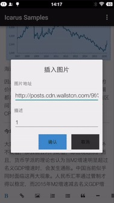

## icarus-android
Maybe the best rich text editor on android platform. Base on [Simditor](https://github.com/mycolorway/simditor)

	


## Features
* Alignment (left/center/right)
* Bold
* Blockquote
* Code
* Horizontal ruler
* Italic
* Image
* Indent
* Link
* Outdent
* Ordered List
* Unordered List
* Underline
* Raw html (Insert anything to any selection range that you want via API)

## Usage
Add this line to your `build.gradle` file under your module directory.
```groovy
compile 'com.github.mr5:icarus:0.1.13-SNAPSHOT'
```
Java codes:
```java
import android.app.Activity;
import android.webkit.WebView;
import android.widget.TextView;

import com.github.mr5.icarus.entity.Options;
import com.github.mr5.icarus.button.TextViewButton;
class EditorActivity extends Activity {
	protected WebView webView;
    protected Icarus icarus;

    @Override
    protected void onCreate(Bundle savedInstanceState) {
        super.onCreate(savedInstanceState);
        // Get WebView from your layout, or create it manually.
        setContentView(R.layout.activity_main);
        webView = (WebView) findViewById(R.id.editor);
        // I offered a toolbar to manage editor buttons which implements TextView that with icon fonts. 
        // It's just a collection, not an Android View implementation. 
        // TextViewToolbar will listen click events on all buttons that added to it. 
        // You can implement your own `Toolbar`, to prevent these default behaviors.
        TextViewToolbar toolbar = new TextViewToolbar();
        Options options = new Options();
        options.setPlaceholder("Placeholder...");
        icarus = new Icarus(toolbar, options, webView);
        TextView boldButton = new TextViewButton()
        boldButton.setName(Button.NAME_BOLD);
		toolbar.addButton(boldButton);
        icarus.render();
    }
 }
```

[Sample](https://github.com/mr5/icarus-android/tree/master/samples)

## Button Names
see [Button.java](library/src/main/java/com/github/mr5/icarus/button/Button.java)

## Options
#### placeholder: String

> Placeholder of Editor. Use the placeholder attribute value of the textarea by default.

default: "Icarus editor."


Example:

```java
options.setPlaceholder("Input something...");
```

#### defaultImage: String

> Default image placeholder. Used when inserting pictures in Edtior.

default: "images/image.png"

Example:

```java
options.setDefaultImage("file:///android_asset/xxx.jpg");
```

#### cleanPaste: Boolean

> Remove all styles in paste content automatically.

default:  false

Example:

```java
options.setCleanPaste(true);
```

#### allowedTags: String[]

> Tags that are allowed in Editor

default: {"br", "span", "a", "img", "b", "strong", "i", "strike", "u", "font", "p", "ul", "ol", "li", "blockquote", "pre", "code", "h1", "h2", "h3", "h4", "hr"}

Example:

```java
// option replacement.
options.setAllowedTags(Arrays.asList("a", "span", "img");
// add tag to current tag list.
options.addAllowedTag("pre");
```

#### allowedAttributes: Map&lt;String, List&lt;String&gt;&gt;


> Whitelist of tag attributes.  Note that custom whitelist will be merged into the default one.

default:

```javascript
img: {"src", "alt", "width", "height", "data-non-image"}
a: {"href", "target"}
font: {"color"}
code: {"class"}
```

Example:

```java
// option replacement.
options.setAllowedAttributes(new HashMap<String, List<String>>());
// add new attribute to current tag list.
options.addAllowedAttributes("a", Arrays.asList("class", "src", "alt", "data-type"));
```

## Load Javascript or Stylesheet files.

```java
icarus.loadCSS("file:///android_asset/editor.css");
icarus.loadJs("file:///android_asset/test.js");
```

## Popover

Some buttons depend user's actions, such as `Button.NAME_LINK`, `Button.NAME_IMAGE`. So you want to show a popover for user to do these actions. Icarus offered 3 Popover Implementations, [`HtmlPopoverImpl`](library/src/main/java/com/github/mr5/icarus/popover/HtmlPopoverImpl.java),  [`ImagePopoverImpl`](library/src/main/java/com/github/mr5/icarus/popover/ImagePopoverImpl.java),  [`LinkPopoverImpl`](library/src/main/java/com/github/mr5/icarus/popover/LinkPopoverImpl.java),  

	

Samples:
```java
TextView imageButtonTextView = (TextView) findViewById(R.id.button_image);
imageButtonTextView.setTypeface(iconfont);
TextViewButton imageButton = new TextViewButton(imageButtonTextView, icarus);
imageButton.setName(Button.NAME_IMAGE);
imageButton.setPopover(new ImagePopoverImpl(imageButtonTextView, icarus));

toolbar.addButton(imageButton);
```

> You can implement your own popover to handler user's actions.

## Insert html to current selection

```java
icarus.insertHtml("<iframe src=\"xxx\"></iframe>");
```

## Contents getting and setting
```java
// Get contents
icarus.getContent(new Callback() {
                @Override
                public void run(String params) {
	                Gson gson = new Gson();
			        Html html = gson.fromJson(params, Html.class);
					Log.d("Content gotten", html.getContent());
                }
            });


// Set contents
icarus.setContent("new content");
```

## License
[MIT](https://opensource.org/licenses/MIT)


[](https://android-arsenal.com/details/1/3601)

